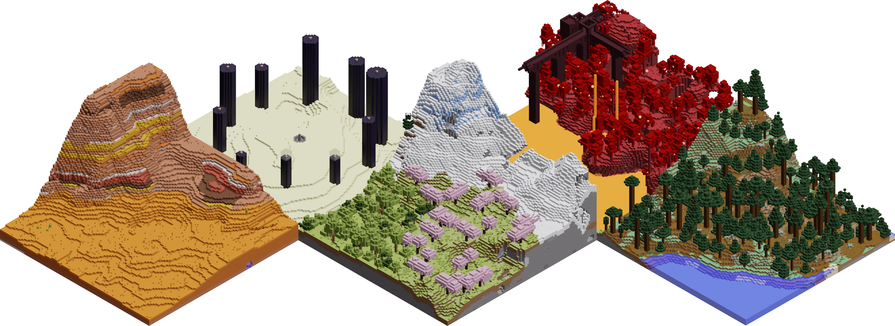

# mcrender - Automatable Minecraft rendering



Command-line tool and Python library for creating isometric Minecraft renders.

mcrender is a wrapper around [Mineways](https://www.realtimerendering.com/erich/minecraft/public/mineways/) and [Blender](https://www.blender.org/), which do the bulk of the work. It automates the communication between these two tools, and offers a command-line/Python interface for them.

Jump to: [Installation](#installation) | [Usage - CLI](#usage---cli) | [Usage - Python](#usage---python) | [Alternatives](#alternatives) | [Acknowledgements](#acknowledgements)


## Installation

mcrender requires Python 3.7+.
It is available on PyPI, and can be installed with `pip`:
```
python3 -m pip install mcrender
```

mcrender depends on [Mineways](https://www.realtimerendering.com/erich/minecraft/public/mineways/) and [Blender](https://www.blender.org/), which need to be installed manually. Mineways is Windows-only, so if you're not on Windows, you will also need [Wine](https://www.winehq.org/).

mcrender has been tested with Mineways 11.0 and Blender 3.6.2, but is expected to work with any previous or future versions with similar APIs. Blender versions before 2.8 are not supported.

In addition, mcrender needs to know how it can access these dependencies: you need to specify commands that will run Mineways and Blender on your system.
It is possible to specify these commands every time you call mcrender, but it is recommended to set default commands in mcrender's config file.

The location of the config file depends on your operating system. It is shown at the bottom of the `mcrender --help` message.
If the config file doesn't exist, mcrender creates a default one when you run it.

The config file has two keys:
- `mineways-cmd`: Command to run Mineways.\
  Set this to a command that will run Mineways on your system. If you run Mineways through Wine, an example command would be `wine /path/to/Mineways.exe`

- `blender-cmd`: Command to run Blender.\
  Set this to a command that will run Blender on your system. The default value `blender` is probably fine.


## Usage - CLI

To run mcrender, use:

```
mcrender [options] <world path> <output path>
```

This will create a render of the Minecraft world at `<world path>`, and save it at `<output path>` in PNG format. (Though note that mcrender will not automatically append the .png extension to `<output path>`.)

You also need to specify which 3D box of the Minecraft world to render. This can be done in two ways:
1. Using `--pos` and `--size`.
2. Using two `--pos` options: one for each corner (inclusive).

### Options
| Option                   | Description                                             | Default     |
|--------------------------|---------------------------------------------------------|-------------|
| `-p, --pos  <x> <y> <z>` | Render-box corner                                       |             |
| `-s, --size <x> <y> <z>` | Render-box size                                         |             |
| `--rotation {0,1,2,3}`   | Rotation of the camera.                                 | 0           |
| `--dimension <id>`       | World dimension.*                                       | `overworld` |
| `--exposure <float>`     | Post-processing exposure (brightness). Can be negative. | 0           |
| `--trim / --no-trim`     | Whether to trim the output image.**                     | `--trim`    |
| `-f, --force`            | Overwrite any existing file at the output path.         |             |
| `--mineways-cmd <cmd>`   | Command to run Mineways. Overrides the config file.     |             |
| `--blender-cmd <cmd>`    | Command to run Blender. Overrides the config file.      |             |
| `-v, --verbose`          | Print more information.                                 |             |
| `-q, --quiet`            | Cancel a previous --verbose.                            |             |
| `--version`              | Show the version and exit.                              |             |
| `--help`                 | Show a help message and exit.                           |             |


*: Dimension options: `overworld`, `the_nether`, `nether`, `the_end`, `end`.

**: The render is always created at a resolution of 2048x2048 pixels, but the model may not be square. If `--trim` is set (which it is by default), the image is trimmed down to the model's bounding box. Otherwise, the model will be centered in the image.

### Example usage
```
mcrender -v /path/to/minecraft-world -p 0 60 0 -s 64 128 64 --rotation 1 snippet.png
```


## Usage - Python

### Core functions

The `mcrender` package has only one public module; everything can be imported directly from `mcrender`. The interface consists primarily of the following thee functions:

- ```python
  def render(
    output_path:  str,
    world_path:   str,
    x:            int,
    y:            int,
    z:            int,
    size_x:       int,
    size_y:       int,
    size_z:       int,
    rotation:     int           = 0,
    dimension:    str           = "overworld",
    exposure:     float         = 0,
    trim:         bool          = True,
    force:        bool          = False,
    mineways_cmd: Optional[str] = None,
    blender_cmd:  Optional[str] = None,
    verbose:      bool          = False,
  )
  ```
  The "main" function of mcrender. Essentially works just like the [command-line interface](#usage---cli): the parameters mirror the CLI arguments and options.
  If `mineways_cmd` or `blender_cmd` is set to `None`, the command from the config file will be used.

- ```python
  def mineways_make_obj(
    output_dir_path: str,
    output_name:     str,
    world_path:      str,
    x:               int,
    y:               int,
    z:               int,
    size_x:          int,
    size_y:          int,
    size_z:          int,
    rotation:        int           = 0,
    dimension:       str           = "overworld",
    mineways_cmd:    Optional[str] = None
  )
  ```
  Does only the Mineways part: creates an OBJ model of a Minecraft world snippet.
  The output OBJ file is written to `<output_dir_path>/<output_name>.obj`.
  Auxillary model files (like textures) are written to `<output_dir_path>`.

- ```python
  def blender_render_obj(
    output_path: str,
    obj_path:    str,
    exposure:    float         = 0,
    trim:        bool          = True,
    force:       bool          = False,
    blender_cmd: Optional[str] = None
  )
  ```
  Does only the Blender part: renders an OBJ file (as created by Mineways) to a PNG image.


### Exceptions

There's a lot that can go wrong when dealing with external programs and the filesystem. The core functions described above can raise the following exceptions:

- `MCRenderError`\
  Base class for all mcrender exceptions.

- `ConfigAccessError`\
  Raised when the config file cannot be accessed.

- `MinewaysCommandNotSetError`\
  Raised when the Mineways command is not set.

- `MinewaysLaunchError`\
  Raised when the Mineways command cannot be launched.

- `MinewaysError`\
  Raised when Mineways returns an error.

- `MinewaysBadWorldError`\
  Raised when Mineways cannot load the world.

- `BlenderCommandNotSetError`\
  Raised when the Blender command is not set.

- `BlenderLaunchError`\
  Raised when the Blender command cannot be launched.

- `BlenderError`\
  Raised when Blender returns an error.

- `OutputFileExistsError`\
  Raised when an output file or directory already exists and cannot be overwritten.

In some circumstances, the core functions may also raise built-in exceptions such as `OSError`.


### Miscellaneous

- `DIMENSIONS`\
  List of supported world dimension identifiers.

- `CONFIG_PATH`\
  Path of the config file on the current operating system.

- `ensure_config_file()`\
  Creates a default config file if it doesn't exist.\
  Raises a ConfigAccessError if creation fails.\
  Note that the core functions will already call this if they need the config file.

### Example usage
```python
import mcrender

mcrender.render(
  "output.png",
  "/path/to/minecraft-world",
  0, 60, 0,
  64, 128, 64
)
```


## Alternatives

Rendering Minecraft worlds is not a new concept. This particular tool is mainly intended for use in scripts or larger systems. It's very automatable, but not very interactive.

Advantages of mcrender compared to other rendering tools:
- Easily automatable
- No need to open Minecraft, modify it, or even install it

Disadvantages:
- Not very interactive; cannot select region in-game.
- Depends on Mineways and Blender, which must be installed separately.

 Here are a few alternatives for different use cases that I came across. Disclaimer: I have not tried most of them, so these descriptions may be inaccurate.

- [Chunky](https://chunky-dev.github.io/docs/)\
  Very extensive GUI rendering system for Minecraft. Can do more than just isometric renders.

- [Isometric Renders mod](https://www.curseforge.com/minecraft/mc-mods/isometric-renders)\
  A mod that allows you to render world snippets or items in-game.

- [mcmap](https://github.com/spoutn1k/mcmap)\
  Creates pixel art renders instead of using Minecraft textures. Has an out-of-game command-line interface similar to mcrender.

- [CyclesMineways](https://github.com/JMY1000/CyclesMineways/)\
  Blender script for rendering Mineways output with Blender's cycles renderer. Compared to mcrender, does not automate the Mineways part and requires an old version of Blender (<2.80), but uses a more sophisticated renderer.

- [A script from World-GAN](https://github.com/Mawiszus/World-GAN/blob/main/minecraft/level_renderer.py)\
  The main inspiration for mcrender. Automates only the Mineways part, but the repository also contains a modified version of CyclesMineways for the Blender part. No command-line interface. Note that the script somewhat confusingly refers to Mineways object creation as "rendering".

- Manual [Mineways](https://www.realtimerendering.com/erich/minecraft/public/mineways/) with a rendering engine (like [Blender](https://www.blender.org/)'s)\
  Mineways creates models of Minecraft world snippets, which can be 3D printed or rendered. Using Mineways and a rending engine separately is more complex, but opens up more possibilities.


## Acknowledgements

mcrender was inspired by the scripts from [World-GAN](https://github.com/Mawiszus/World-GAN), as described under [Alternatives](#alternatives).

Blender files were created by [Björn van der scheer](https://bluespike.artstation.com/).
